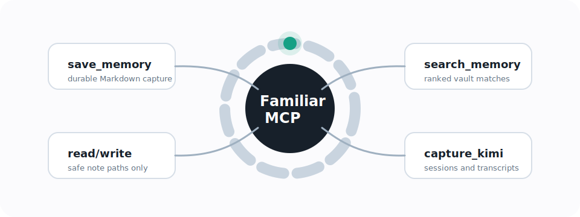

# Familiar Second Brain

Local MCP server and Kimi Work skill for turning a Familiar Markdown vault into a second brain.



## What This Does

Familiar Second Brain connects three local pieces:

- A Markdown vault at `~/Documents/kimi/workspace/familiar-vault`.
- A Kimi Work skill that saves session summaries and transcripts into that vault.
- A stdio MCP server that lets MCP clients save, search, read, and write vault notes.

The result is simple: when you ask Kimi Work or another MCP-capable app to use `familiar`, it can work against the same local Markdown brain instead of scattering context across desktop files.

## Capabilities

| Capability | Where it lives | Output |
| --- | --- | --- |
| Save durable memories | `save_memory` MCP tool and Kimi skill | Markdown notes in `_Inbox/` or project folders |
| Search the brain | `search_memory` MCP tool | Ranked Markdown matches with excerpts |
| Read and write notes | `read_note`, `write_note` MCP tools | Plain `.md` files inside the vault |
| Capture Kimi sessions | `summarize_sessions.py` | `Daily/Kimi Sessions/` and `Daily/Kimi Transcripts/` |
| Share with apps | MCP configs | Kimi Work, Codex, Claude, Cursor |

## Quick Start

Run the installer in dry-run mode first:

```bash
cd /Users/arnavdas/Downloads/familiar-second-brain
/usr/bin/python3 scripts/install.py --dry-run
```

Install into the current local Kimi/Familiar setup:

```bash
/usr/bin/python3 scripts/install.py
```

Smoke-test the MCP server:

```bash
make smoke
```

Run the full test suite:

```bash
make test
```

## Repo Layout

```text
familiar-second-brain/
  src/
    familiar_mcp_server.py        # stdio MCP server
  kimi_skill/
    SKILL.md                      # Kimi Work behavior guide
    scripts/
      save_to_familiar.py         # quick note capture helper
      summarize_sessions.py       # Kimi session summary and transcript capture
    tests/
  scripts/
    install.py                    # local installer and config writer
    smoke_mcp.py                  # stdio MCP smoke test
  docs/
    architecture.md
    installation.md
    operations.md
    security.md
    assets/*.svg                  # animated diagrams
```

## MCP Tools



The server exposes these tools:

- `save_memory`: create a Markdown note in the vault.
- `search_memory`: search Markdown notes by keyword.
- `read_note`: read a note by relative path.
- `write_note`: write a Markdown note by relative path.
- `list_recent_notes`: list recently modified notes.
- `capture_kimi_sessions`: run the Kimi session capture job.
- `vault_status`: report vault paths and note count.

## Live Paths

Default install paths:

```text
Vault:
~/Documents/kimi/workspace/familiar-vault

MCP server:
~/Documents/kimi/workspace/familiar-vault/.familiar/mcp/familiar_mcp_server.py

Kimi skill:
~/Library/Application Support/kimi-desktop/daimon-share/daimon/skills/familiar-second-brain

Kimi generated MCP config:
~/Library/Application Support/kimi-desktop/daimon-share/daimon/runtime/kimi-code/home/mcp.json
```

The repo deliberately does not include personal vault notes, Kimi transcripts, API keys, or app databases.

## Documentation

- [Architecture](docs/architecture.md)
- [Installation](docs/installation.md)
- [Operations](docs/operations.md)
- [Roadmap](docs/roadmap.md)
- [Security](docs/security.md)

## Development

This project uses only the Python standard library.

```bash
make test
make smoke
```

For MCP protocol debugging, run:

```bash
/usr/bin/python3 scripts/smoke_mcp.py \
  --server src/familiar_mcp_server.py \
  --vault ~/Documents/kimi/workspace/familiar-vault
```
